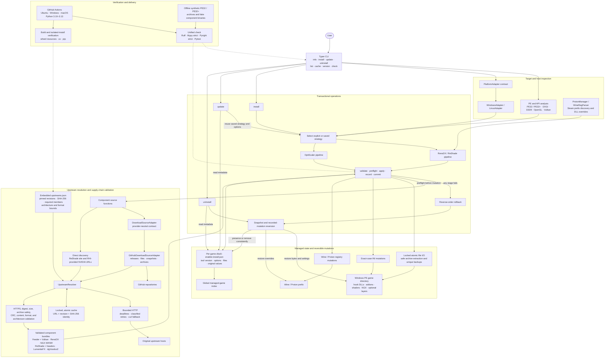

# DLSS5 Enabler

Transactional command-line installer for managing RenoDX/Feeder and OptiScaler Neural Rendering strategies in Windows games.

[](https://www.python.org/)
[](https://github.com/al4xdev/dlss5-enabler/actions/workflows/ci.yml)
[](pyproject.toml)
[](LICENSE)

DLSS5 Enabler automates setups that would otherwise require manually coordinating several upstream projects, selecting the correct binaries, configuring a proxy, and preserving enough state to undo every change later. It offers two independent strategies:

- **RenoDX/ReShade** is the general path for Windows and experimental Linux / SteamOS. It also covers the optional DirectX 9, OpenGL, and Vulkan integrations.
- **OptiScaler** is the focused path for native-DLSS x64 games on Windows using DirectX 11 or 12. It provides direct access to DLSS Neural Rendering multipass and experimental frame-generation routing with a smaller game-side stack.

OptiScaler currently uses the pinned y4my4my4m DLSSNR Multipass v3 package because that is the validated package available for this integration. The installer keeps the strategy boundary explicit, so a future compatible and better-maintained project can replace that upstream without changing the install, update, switch, and uninstall model. Such a replacement would still require its own validation and release.

It combines:

- [DLSS5-Feeder](https://github.com/jlrouzies-fr/DLSS5-Feeder)
- [RenoDX](https://github.com/RankFTW/rhi-repo)
- [OptiScaler DLSSNR Multipass](https://github.com/y4my4my4m/OptiScaler_DLSSNR_Multipass_MFG)
- [ReShade with Addon support](https://reshade.me/)
- NVIDIA NGX DLSS binaries discovered through the RenoDX manifest
- [LumeniteFX](https://github.com/umar-afzaal/LumeniteFX) motion-vector shaders
- [dgVoodoo2](https://github.com/dege-diosg/dgVoodoo2) for optional DirectX 9 translation

> [!IMPORTANT]
> DLSS5 Enabler is an unofficial community tool. It is not affiliated with or endorsed by NVIDIA, ReShade, RenoDX, or the other upstream projects. “DLSS 5” is used because that is how users commonly search for this stack; the tool does not add native engine integration and compatibility varies by game.

## Why this exists

The rendering stack spans multiple binaries, configuration files, graphics APIs, architectures, and operating systems. A failed manual installation can overwrite an existing hook DLL, leave a partial ReShade setup, or persist a Wine registry override after the files it points to are gone.

DLSS5 Enabler treats installation as a transaction. It validates the target first, records every managed mutation, and rolls changes back in reverse order if a later stage fails.

## Engineering scope

Although the user-facing job is game mod orchestration, the project exercises broader software-engineering concerns:

- PE32 and PE32+ binary inspection, architecture selection, and graphics API heuristics;
- provider-neutral upstream discovery with bounded HTTP retries and immutable fallbacks;
- streaming downloads, content hashing, cache identity, and software supply-chain validation;
- safe ZIP and 7z extraction across Windows and POSIX path conventions;
- transactional filesystem and Wine registry changes with rollback and byte-for-byte restoration;
- typed metadata migrations that preserve installation choices across CLI upgrades;
- cross-platform packaging and automated validation on Windows, experimental Linux, and macOS.

macOS is a CI portability target for the Python, archive, cache, and packaging layers. It is not presented as a DLSS runtime or game-installation target.

## Reliability by design

The project is built to fail safely when downloads, permissions, extraction, or configuration do not behave as expected.

- **Transactional installation:** all installation stages and critical finalization steps participate in rollback, including the stage that reports the failure.
- **Recoverable refreshes:** an existing managed installation is snapshotted before replacement and restored if the new installation fails.
- **Safe uninstallation:** original DLLs and backed-up INI bytes are restored before metadata is removed; Wine registry changes restore the recorded original values.
- **Atomic writes:** records, indexes, cache metadata, registry files, and INI files are written through a temporary file followed by replacement.
- **Concurrent-operation locks:** per-game operations and shared state use filesystem locks to prevent overlapping writes.
- **Non-destructive backups:** existing files receive unique backup names; an older backup is never silently overwritten.
- **Validated downloads:** HTTPS certificate verification remains enabled, incomplete downloads use isolated temporary files, and an existing valid destination survives a failed refresh.
- **Validated fallback:** incompatible latest artifacts produce a warning and fall back to a pinned revision with an exact SHA-256 check.
- **Safe extraction:** archive members are checked for absolute paths, parent traversal, and flattened-name collisions before extraction.
- **Cache identity checks:** cached components are tied to their source URL, version or revision, and SHA-256 digest.
- **Preflight resolution:** every required upstream is downloaded and validated before an existing installation is removed or a game file is changed.
- **Strict verification:** Ruff, Mypy strict, Pyright strict, and the complete test suite run through one command.

These protections reduce the chance of a broken game directory, but they cannot guarantee compatibility with every game, mod loader, anti-cheat system, or upstream release.

## Choose a strategy

| Strategy | Choose it when | Current advantages | Current limits |
| --- | --- | --- | --- |
| RenoDX/ReShade | You want the broadest supported route, or need DirectX 9, OpenGL, Vulkan, Wine, Proton, or SteamOS support | Broader platform and graphics-API coverage; automatic upstream discovery; optional LumeniteFX | More components participate in the game-side stack |
| OptiScaler | The game is Windows x64, uses DirectX 11/12, and already has native DLSS | Direct DLSS Neural Rendering multipass controls; experimental frame-generation routing; no ReShade/Feeder composition in this strategy | Windows only; requires native DLSS and the exact validated local archive; game compatibility varies |

Choosing OptiScaler does not make a non-DLSS game compatible. Native DLSS is the temporal input required by this initial integration. Frame generation is a separate experimental output and does not need to be native to the game when the selected OptiScaler route can provide it.

## Installation paths

| Rendering path | Mode | Installed integration |
| --- | --- | --- |
| DirectX 11 / 12 | Default | ReShade `dxgi.dll` |
| Native DLSS on Windows x64 DirectX 11 / 12 | `--engine optiscaler` | Validated OptiScaler proxy, default `dxgi.dll` |
| DirectX 9 | automatic, or `--d3d9` | dgVoodoo2 translation plus the 64-bit feeder host when required |
| OpenGL | `--opengl` | ReShade `opengl32.dll` |
| Vulkan | `--vulkan-layer` | Feeder Vulkan-layer fallback when available upstream |
| 32-bit games | Automatic detection | 32-bit feeder addon with a 64-bit host bridge |

These are implemented installer paths, not claims of universal compatibility with every engine or game. Automated tests validate API detection, architecture selection, file placement, configuration, rollback, and cleanup with synthetic binaries. Actual rendering compatibility still depends on the game, driver, mod stack, and upstream components.

## Platform and target model

| Environment | Role |
| --- | --- |
| Windows | Runs the CLI and manages a native Windows game executable |
| Experimental Linux / SteamOS | Runs the CLI and manages a Windows game executable through Wine or Proton |
| macOS | Runs portability, packaging, and synthetic-artifact checks in CI only |

The installation target must be a Windows PE executable. Native Linux ELF binaries are inspected for diagnostics but are rejected as installation targets, and the project does not claim a native macOS DLSS runtime.

## Requirements

- Python 3.10 or newer
- [`uv`](https://docs.astral.sh/uv/) (recommended) or pip
- An NVIDIA RTX GPU supported by the downloaded NGX runtime
- A game installation you can write to
- Internet access for the first component download
- The exact supported y4my4my4m v3 ZIP when first selecting OptiScaler

## Quick start

There are two different kinds of update:

| Goal | Command |
| --- | --- |
| Update the **DLSS5 Enabler program** installed with `uv` | `uv tool upgrade dlss5-enabler` |
| Update the **managed files in a game** while preserving its strategy | `dlss5-enabler update "C:\Games\Example\game.exe"` |

Start by inspecting the game. This does not modify it:

```console
dlss5-enabler info "C:\Games\Example\game.exe"
```

For the general RenoDX/ReShade strategy, install with the default command:

```console
dlss5-enabler install "C:\Games\Example\game.exe"
```

For a compatible native-DLSS x64 DirectX 11/12 game on Windows, select OptiScaler and provide the supported archive the first time:

```console
dlss5-enabler install --engine optiscaler --optiscaler-archive "C:\Downloads\OptiScaler_DLSSNR_MultiPass_MFG6X_fix_v3_by_y4my4my4m.zip" "C:\Games\Example\game.exe"
```

After installation, use `info` to review the saved strategy and options, `update` to refresh it, and `uninstall` to restore the recorded original files.

## Install the CLI

Run the latest release without installing it:

```console
uvx dlss5-enabler@latest --help
uvx dlss5-enabler@latest info "/path/to/game.exe"
uvx dlss5-enabler@latest install "/path/to/game.exe"
```

For frequent use, install the latest release persistently with `uv`:

```console
uv tool install dlss5-enabler@latest
dlss5-enabler --help
```

Update a persistent `uv` installation with `uv tool upgrade dlss5-enabler`. This updates the command-line program; run `dlss5-enabler update TARGET` separately when you want to refresh a managed game.

### Install with pip

```console
python -m pip install --upgrade dlss5-enabler
dlss5-enabler --help
```

### Run from source

From a local checkout:

```console
uv sync
uv run dlss5-enabler --help
uv run dlss5-enabler info "/path/to/game.exe"
uv run dlss5-enabler install "/path/to/game.exe"
```

On Windows, PowerShell and `cmd.exe` paths work normally:

```console
dlss5-enabler install "C:\Games\Example\game.exe"
```

On SteamOS or experimental Linux, point to the Windows executable inside the Steam library:

```console
dlss5-enabler install "/home/deck/.local/share/Steam/steamapps/common/Example/game.exe"
```

When the matching Proton prefix can be identified, the tool updates the required Wine DLL override and prints the corresponding Steam launch options.

## Commands

### Inspect a game

```console
dlss5-enabler info "/path/to/game.exe"
```

Reports architecture, imported graphics APIs, write access, installed and current tool versions, saved options, component versions, and a detected Proton prefix.

For a game already managed by DLSS5 Enabler, `info`, `install`, `update`, and `uninstall` also accept its executable name, for example `dlss5-enabler info Control_DX12.exe`. If more than one managed game has that name, the CLI lists the matching paths and requires the full path.

### Install

```console
dlss5-enabler install [OPTIONS] "/path/to/game.exe"
```

Options:

| Option | Purpose |
| --- | --- |
| `--lumenite` / `--no-lumenite` | Enable or disable LumeniteFX; enabled by default |
| `--d3d9`, `--no-d3d9` | Override automatic DirectX 9 detection; dgVoodoo2 is enabled automatically only for detected D3D9 games |
| `--opengl` | Use the OpenGL ReShade hook |
| `--vulkan-layer` | Request the Vulkan-layer fallback |
| `--engine renodx` | Use the RenoDX/ReShade strategy; this is the default |
| `--engine optiscaler` | Use OptiScaler for a supported native-DLSS Windows x64 game |
| `--optiscaler-archive PATH` | Import the supported y4my4my4m v3 ZIP and cache it by SHA-256 |
| `--nr-passes 1..5` | Set the OptiScaler DLSS Neural Rendering pass count |
| `--nr-placement after|before|inside` | Choose where Neural Rendering runs relative to the upscaler; defaults to `after` |
| `--frame-generation auto|off|fsr|dlssg` | Select the OptiScaler frame-generation output; defaults to `auto` |
| `--fg-multiplier 2..6` | Select the experimental DLSS-G multiplier; values above 2 require `--frame-generation dlssg` |
| `--optiscaler-proxy NAME` | Select a supported proxy filename; defaults to `dxgi.dll` |
| `-f`, `--force-download` | Ignore cached assets and fetch them again |
| `-v`, `--verbose` | Enable detailed console and file logging |

DirectX 9 translation is automatic when neither override is passed. `--d3d9` forces it, while `--no-d3d9` keeps the direct hook even when D3D9 is detected. `--d3d9` and `--opengl` cannot be combined.

The supported OptiScaler archive is `OptiScaler_DLSSNR_MultiPass_MFG6X_fix_v3_by_y4my4my4m.zip` with SHA-256 `f927b5aed15d09b23f559433d6740834f550d79bb2b75c7315602319819a3096`. The author currently publishes this build outside GitHub releases; the CLI does not invent a download URL or silently replace it with another fork.

### OptiScaler Neural Rendering placement

The default `--nr-placement after` runs Neural Rendering after upscaling at output resolution. It is the simplest compatibility baseline and usually has the highest GPU cost.

`--nr-placement before` runs Neural Rendering at the lower internal resolution before the upscaler. This can improve performance. In the manual Control test used for this release, it increased frame rate without a visible quality loss, so it is the first alternative worth trying:

```console
dlss5-enabler install --engine optiscaler --optiscaler-archive "C:\Downloads\OptiScaler_DLSSNR_MultiPass_MFG6X_fix_v3_by_y4my4my4m.zip" --nr-placement before "C:\Games\Control\Control_DX12.exe"
```

`--nr-placement inside` lets the OptiScaler pipeline place Neural Rendering inside the upscaling process. It is experimental and can behave differently across games and upstream builds. None of these placement modes guarantees the same performance or image quality in another game, resolution, or driver.

### Experimental frame generation

`--frame-generation auto` is the OptiScaler default. It chooses the FSR frame-generation output for the broadest compatibility, including games that have native DLSS upscaling but no native frame generation. Use `off`, `fsr`, or `dlssg` to make the choice explicit.

The DLSS-G path also applies a GPU-generation profile inside the OptiScaler strategy. RTX 40-series GPUs enable the package's Ada unlock, Ada kernels, and flip-metering compatibility settings. RTX 50-series GPUs disable those Ada overrides and use their native profile. Older or unidentified GPUs are not allowed to select DLSS-G and remain on FSR in `auto` mode. This detection only selects OptiScaler configuration. It does not broaden the current Windows x64 DirectX 11/12 support boundary.

A manual smoke test in Control confirmed that the FSR frame-generation output can work even though Control has no native frame generation. In the same setup, the OptiScaler UI reported that DLSS-G required HDR10 and DLSS-G did not work in Control; changing Control's HDR setting did not make that route usable. This is one experimental observation, not a rule that DLSS-G always requires HDR10 or a promise that FSR frame generation works in every game.

### Update a managed game

```console
dlss5-enabler update "/path/to/game.exe"
dlss5-enabler update Control_DX12.exe
```

An ordinary `update` preserves the recorded strategy and its options. You do not need to repeat the original flags:

```console
dlss5-enabler update "C:\Games\Example\game.exe"
```

Use `--reinstall` when you want to reapply the same saved strategy even though the game already reports the current version. Add `--force-download` only when you also want to bypass downloadable component caches.

Switch from RenoDX to OptiScaler explicitly only when the target satisfies the OptiScaler requirements:

```console
dlss5-enabler switch "C:\Games\Example\game.exe" optiscaler --optiscaler-archive "C:\Downloads\OptiScaler_DLSSNR_MultiPass_MFG6X_fix_v3_by_y4my4my4m.zip"
```

Switch back to RenoDX explicitly with:

```console
dlss5-enabler switch "C:\Games\Example\game.exe" renodx
```

The switch is transactional: the CLI stages and validates the selected strategy before replacing the managed installation. Later OptiScaler updates reuse the cached archive only when its hash matches the recorded revision. The older `update GAME --engine ENGINE` form remains compatible, but `switch` makes the intent clearer. An ordinary update never changes strategy silently. A game installed by a newer CLI is never downgraded.

For a saved OptiScaler installation, `--nr-passes`, `--nr-placement`, `--frame-generation`, and `--optiscaler-proxy` override only the named setting during an update. The other recorded options remain unchanged.

Installation records use schema 5. `strategy_options.kind` records whether RenoDX/ReShade or OptiScaler owns the installation, along with the strategy-specific options and OptiScaler source revision. Older supported records migrate in memory through each schema version, and successful installation or update saves the current schema. Inspecting a game does not rewrite its record. Unknown future schemas, malformed records, and unknown engines are rejected and preserved.

If recovery cannot finish, the command reports incomplete recovery and retains a snapshot directory containing `recovery.json` and saved files. Keep that directory for recovery. A separate cleanup warning means installation committed successfully but a temporary staging or recovery directory could not be removed.

### Uninstall

```console
dlss5-enabler uninstall "/path/to/game.exe"
```

The target may be the game executable or its directory. For a uniquely managed game, its executable name also works:

```console
dlss5-enabler uninstall Control_DX12.exe
```

If multiple managed games have the same executable name, the command lists the matching paths and requires a full path. Only files and settings recorded by DLSS5 Enabler are reverted.

### List managed games

```console
dlss5-enabler list
```

The list compares each saved installation version with the running CLI locally; it does not make one network request per game.

### Inspect or clear the download cache

```console
dlss5-enabler cache
dlss5-enabler cache --clean
```

### Show or check the CLI version

```console
dlss5-enabler version
dlss5-enabler version --check
```

`install`, `update`, `info`, and `list` perform a non-blocking PyPI version check at most once every 24 hours per shared cache. The marker is empty and stores no version data. A newer release only produces an update recommendation; the CLI never updates itself. Use `uv tool upgrade dlss5-enabler` or `python -m pip install --upgrade dlss5-enabler` to update explicitly.

## Installation pipeline

Each engine has a separate typed pipeline. The RenoDX pipeline separates target analysis, component selection, preparation, and game mutations:

1. Validate the executable and collect architecture, API hints, and native DLSS evidence.
2. Select the RenoDX components and proxy.
3. Discover, download, and validate required upstream components.
4. Validate the selected files and extract ReShade into isolated staging.
5. Snapshot and remove a previous managed installation when refreshing.
6. Place the correct ReShade Addon DLL and configure its INI.
7. Configure dgVoodoo2 when DirectX 9 translation is requested.
8. Place Feeder when needed and the ReShade shader headers.
9. Place RenoDX and the architecture-appropriate NGX binaries.
10. Place LumeniteFX and configure its motion-vector provider.
11. Install the Vulkan fallback when requested and available.
12. Mirror managed files into `bin/` for layouts that require it.
13. Apply Wine/Proton DLL overrides when applicable.
14. Save the installation record and update the global index.

ReShade installation extracts the official package without executing its setup program. File placement and configuration changes go through the Enabler transaction. Critical finalization completes before recovery snapshots are discarded.

The OptiScaler pipeline validates Windows, x64, native DLSS, DirectX 11/12 evidence, the exact local archive hash, every archive path, final destination collisions, and the NVIDIA NR runtime before removing an existing installation. Its profile configures the selected NR placement and frame-generation output, disables ReShade/Special K loading, automatic capture, non-DLSS inputs, and upstream update checks. GPU-generation detection affects only the DLSS-G compatibility profile. The overlay key is Delete. Existing `dlssnr-capture` paths are refused because this fork can delete that directory internally.

New installations record created directories and runtime artifacts, including preexisting files that cleanup must preserve. Older records lack some of that ownership information, so untracked legacy logs, screenshots, or empty directories are preserved. Legacy INI entries without whole-file backups can restore only their recorded values; schema migration cannot reconstruct original bytes that were never saved.

## Upstream fallback policy

The wheel contains `dlss5_enabler/upstreams.json`, which pins a known-compatible fallback for every downloaded component. A normal RenoDX installation still tries the newest upstream revision first. The OptiScaler fork has no published release asset, so it is accepted only from an explicitly supplied local ZIP with the supported SHA-256 and then stored in a hash-addressed local cache. Candidates are checked for provenance, size or digest, archive safety, required contents, supported layout, and architecture before entering the cache.

When the latest revision cannot be discovered, downloaded, or validated, the CLI emits an `UPSTREAM_*` warning and tries the pinned fallback. A fallback is accepted only when its exact SHA-256 and content policy match the embedded manifest. The successful installation summary lists every fallback used. If both candidates fail, the command stops without cleaning an existing installation or modifying the game.

The main warning codes distinguish discovery, missing or ambiguous assets, timeout, rejected HTTP responses, digest mismatch, unsafe archives, missing content, unsupported formats, fallback use, and fallback failure. The detailed log includes the component and revisions involved without exposing authenticated URLs.

## Local state

| Platform | Data and cache location |
| --- | --- |
| Windows | `%LOCALAPPDATA%\DLSS5 Enabler` |
| Experimental Linux / SteamOS | XDG data, cache, config, and state directories under `dlss5-enabler` |
| Per game | `dlss5-enabler.install.json` beside the game executable |

The log file is named `dlss5-enabler.log`.

## Architecture

```text
dlss5_enabler/
├── core/          Binary inspection, exact-case INI handling, records, atomic I/O
├── network/       HTTPS downloads, release discovery, cache validation
├── operations/    Typed RenoDX and OptiScaler pipelines, shared transactions, update, and uninstall
├── schemas/       Versioned records and chained Python migrations
├── platform/      Windows, experimental Linux, Wine, Proton, and Steam discovery adapters
├── check.py       Unified quality runner
└── cli.py         Typer command-line interface
```



The Python import namespace uses an underscore (`dlss5_enabler`); the package and executable use a hyphen (`dlss5-enabler`).

GitHub is implemented behind the provider-neutral download-source contract in `network/adapters.py`. Release, repository-file, snapshot, and archive discovery stay in the adapter; component validation and fallback policy stay in the resolver. A future mirror should implement the same adapter contract and return the same neutral asset models instead of adding provider-specific branches to component code.

## Development

Install all dependencies and run the complete verification suite:

```console
uv sync
uv run dlss5-enabler check
```

`uv run` is reserved for commands executed from a project checkout. Installed users should use `dlss5-enabler` directly or `uvx dlss5-enabler@latest` for ephemeral execution.

The unified check requires all of the following to pass with no warnings:

- Ruff formatting
- Ruff linting
- Mypy strict type checking
- Pyright strict type checking
- Pytest

Maintainers can inspect a candidate pin without modifying the manifest:

```console
uv run dlss5-enabler-update-upstream COMPONENT REVISION ASSET_NAME HTTPS_URL
```

The command downloads to a temporary directory, validates the component layout, and prints the resolved revision, size, SHA-256, and recognized format. Add `--write --manifest dlss5_enabler/upstreams.json` only after reviewing that output; the tool never chooses `latest` or rewrites the manifest implicitly.

## Upstream projects

DLSS5 Enabler is inspired by and builds on the work of:

- [FeedKit](https://github.com/ntqueryinformation/FeedKit)
- [DLSS5-Feeder](https://github.com/jlrouzies-fr/DLSS5-Feeder)
- [RenoDX / RHI](https://github.com/RankFTW/rhi-repo)
- [ReShade](https://github.com/crosire/reshade)
- [LumeniteFX](https://github.com/umar-afzaal/LumeniteFX)
- [dgVoodoo2](https://github.com/dege-diosg/dgVoodoo2)

Each downloaded component remains subject to its upstream license and terms.

## License

DLSS5 Enabler itself is distributed under the [MIT License](LICENSE).

## Disclaimer

DLSS5 Enabler is an independent, unofficial community project. It is not an NVIDIA product, is not affiliated with NVIDIA Corporation, and is not sponsored, reviewed, approved, or endorsed by NVIDIA or any of the upstream projects named in this document. NVIDIA, DLSS, GeForce, and related names and marks belong to NVIDIA Corporation in the United States and other countries. Other names and marks belong to their respective owners.

The maintainer develops only the installer and orchestration code in this repository. The maintainer does not create, own, host, bundle, redistribute, audit, warrant, support, or maintain NVIDIA DLSS/NGX binaries or the third-party components installed by this tool. DLSS5 Enabler only discovers release information and directs downloads to the original upstream websites, repositories, manifests, or content servers at runtime. Availability, licensing, integrity, compatibility, behavior, and support for those downloads remain the responsibility of their respective providers.

Report problems with DLSS5 Enabler's installation, rollback, detection, or command-line behavior in this project's issue tracker. Report problems inside DLSS, DLSS5-Feeder, RenoDX, ReShade, LumeniteFX, dgVoodoo2, or another downloaded component to that component's own maintainer.

Use this tool at your own risk. Back up important game files and respect each game's modding, multiplayer, and anti-cheat policies. No guarantee is made that any particular game, driver, GPU, mod stack, or future upstream release will work.
